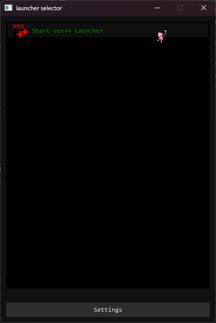
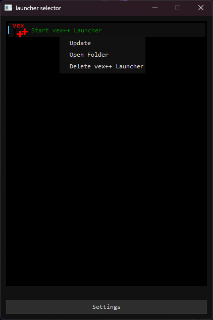
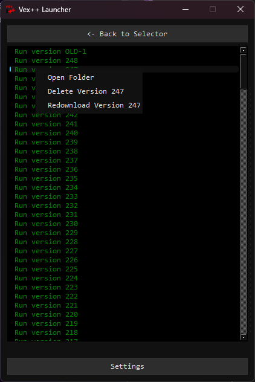

to start first download the repo and run either `launcher.cmd` or `launcher.sh` which will setup the python project. this step will take longer the first time.

after the launcher is opened it may look blank if you don't have any launchers loaded to load them jst put the launchers .py file in the same dir as the `launcher.(cmd/sh)` then rerun the launcher script and the games launcher should be visible

a sample script can be found [here](https://github.com/rsa17826/vex-plus-plus/blob/main/launcher/vex%2B%2B.py)

when opening the launcher it will look like

to open a game launcher double click on the item when inside a launcher it can look like this

orange bar is waiting to download.

blue bar is downloading.

green text is installed.

blue text is not installed.

the versions are sorted by:

- the most recently played version
- downloads in progress
- downloads waiting to start
- other versions

all groups are sorted by largest numbers first

to remove a game version or launcher right click on the launcher or game version and press delete

---

for if making a launcher for this there is a .url file that can be used located at [./\_/base launcher files.url](./_/base%20launcher%20files.url) that points to this repo

<!-- if protocol handle is registered links like multi-game-launcher:downloadLauncher/https://github.com/rsa17826/vex-plus-plus/blob/main/launcher/vex%2B%2B.py -->
<!-- if protocol handle is registered links like [this](multi-game-launcher:downloadLauncher/vex++/https://github.com/rsa17826/vex-plus-plus/releases/latest/download/launcher.zip) -->

if protocol handle is registered links like [this](multi-game-launcher:downloadLauncher/vex++/rsa17826/vex-plus-plus/launcher.zip)
