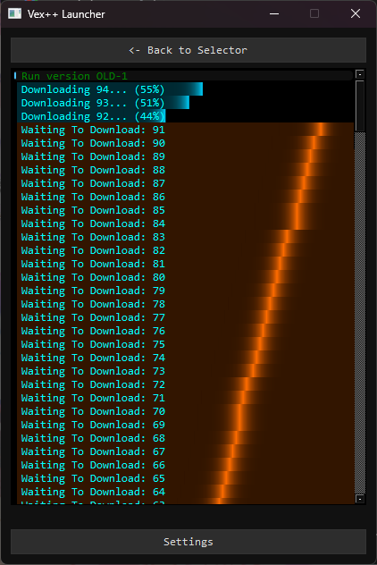

to start first download the repo and run either `launcher.cmd` or `launcher.sh` which will setup the python project. this step will take longer the first time.

after the launcher is opened it may look blank if you don't have any launchers loaded to load them jst put the launchers .py file in the same dir as the `launcher.(cmd/sh)` then rerun the launcher script and the games launcher should be visible
